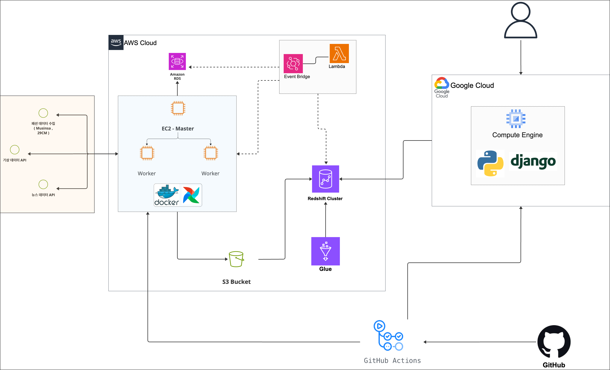

# Temp_Trend
---
## 주제
---
날씨정보에 맞는 트렌디한 옷 추천 서비스

## 활용데이터
---
| Source | Data                        | Link                                                                                      |
|--------|-----------------------------|-------------------------------------------------------------------------------------------|
| 29CM   | Category, price, Rank...    | [29CM Best Items](https://shop.29cm.co.kr/best-items?category_large_code=268100100)   |

## 활용기술 및 프레임워크
---
| 분류                | 기술                                          |
|---------------------|-----------------------------------------------|
| 프로그래밍언어       | 🐍 Python, 🌐 JavaScript                      |
| 웹 프레임워크        | 🌟 Django                                     |
| 데이터베이스         | 🗄️ Postgres, 🧱 Redis, 📊 Redshift Cluster    |
| 클라우드 서비스      | ☁️ EC2, ☁️ RDS, ☁️ Redshift Cluster, ☁️ EventBridge, ☁️ Lambda, ☁️ Glue, ☁️ GCP |
| 데이터 파이프라인    | 🔄 Apache Airflow                              |
| 버전 관리            | 🐙 Git, ⚙️ Git Actions                        |

## 아키텍쳐
---

## 프로젝트 보고서
---
[보고서 사이트 링크](https://www.canva.com/design/DAGNoDAbJ6s/zMFla5cpJsxTEQtNYdDiLA/edit)

## 프로젝트 세부결과
---
- 결과 1: 설명
- 결과 2: 설명
- 결과 3: 설명