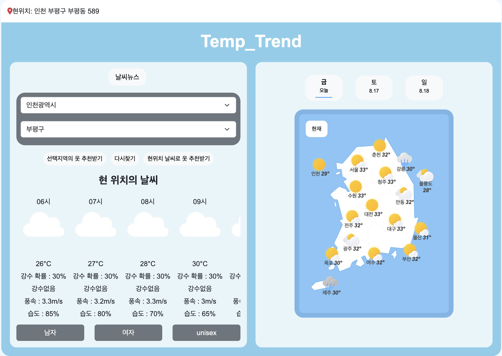
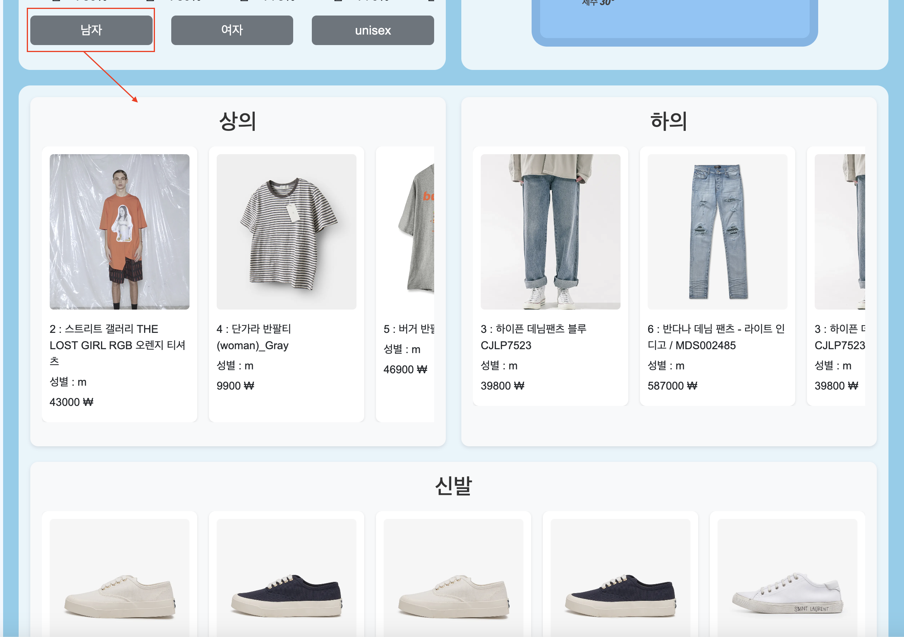
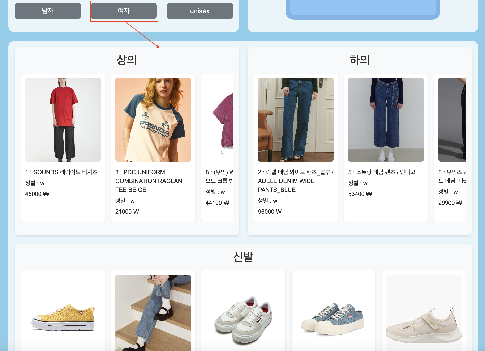

# Temp_Trend

## 주제
날씨정보에 맞는 트렌디한 옷 추천 서비스

## 프로젝트 개요
### 1. 내용

본 프로젝트는 일별 기상 데이터와 뉴스 데이터를 수집하고, 대표적인 국내 온라인 셀렉트샵인 무신사와 29CM의 각 카테고리별 베스트 상품 데이터를 활용하여, 
날씨에 따른 카테고리 추천 모델을 구축하였습니다. 
이를 통해 사용자에게 현재 날씨와 관련된 인기 상품을 추천함으로써, 사용자에게 날씨와 가장 연관된 아이템 정보를 제공하고, 궁극적으로 쇼핑 경험을 개선하고자 하였습니다.

### 2. 기간

2024.07.22 ~ 2024.08.16

### 3. 활용데이터

| Source | Data                        | Link                                                                                      |
|--------|-----------------------------|-------------------------------------------------------------------------------------------|
| 29CM   | ProductName,Category,Price,Rank,Gender,...| [29CM](https://shop.29cm.co.kr/best-items?category_large_code=268100100)   |
| Musinsa   | ProductName,Category,Price,Rank,Gender,...| [Musinsa](https://www.musinsa.com/main/)   |
| 전국날씨 | Date,WeatherCode,fcstdate,fcsttime,fcstvalue,nx,ny| [공공데이터포털](https://www.data.go.kr/data/15084084/openapi.do)   |
| 기상뉴스 | id,Title,Description,Link,Pubdate,imageURL| [네이버뉴스](https://developers.naver.com/docs/serviceapi/search/news/news.md)   |

### 4. 활용기술 및 프레임워크

| 분류                | 기술                                          |
|---------------------|-----------------------------------------------|
| 프로그래밍언어       |   |
| 웹 프레임워크        | |
| 데이터베이스         |    |
| 클라우드 서비스      |               |
| 데이터 파이프라인    | |
| 버전 관리            |  |

### 5. 프로젝트 보고서

[Temp_Trend PPT 보러가기](https://www.canva.com/design/DAGNoDAbJ6s/zMFla5cpJsxTEQtNYdDiLA/edit)

### 6. 팀원 및 역할

| 이름 | 역할                        | 기여도                                                                                      |
|--------|-----------------------------|-------------------------------------------------------------------------------------------|
| 안재영 | 전국 기상데이터 수집, 웹페이지 구현-기상데이터                      |   25%        |
| 이정화 | 날씨 관련 뉴스 데이터 수집, CI/CD 관리, Django 배포 및 환경구성                      |   25%        |
| 박도윤 | 패션 데이터 수집 - 무신사, 웹페이지 구현-패션데이터                      |   25%        |
| 이하영 | 패션 데이터 수집 - 29CM, AWS 인프라 구축 및 관리                      |   25%        |

## 프로젝트 세부결과
### 1. 아키텍쳐

### 2. 구현

- 메인 페이지 구성

- 날씨와 성별에 따른 추천 아이템 목록

- 시연영상  

